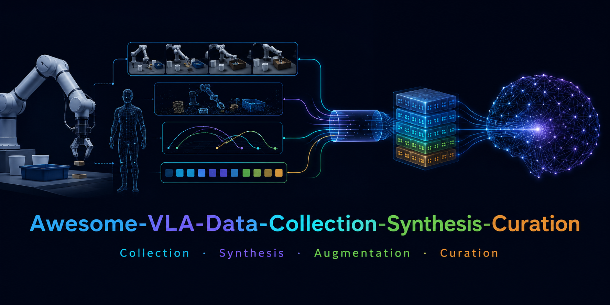

<!-- ════════════════════════════════════════════════════════════════════ -->
<!--                           HERO BANNER                              -->
<!-- ════════════════════════════════════════════════════════════════════ -->

  

 

  

  

 

# Awesome VLA Data Collection, Synthesis, and Curation

A curated list of data-centric methods for Vision-Language-Action models and robot foundation models: collection, simulation, digital twins, cross-embodiment augmentation, neural trajectories, RL-generated rollouts, cleaning, preprocessing, annotation, and benchmarks.

 

<!-- ════════════════════════════════════════════════════════════════════ -->
<!--                          NAVIGATION CARDS                          -->
<!-- ════════════════════════════════════════════════════════════════════ -->

<table width="100%">
<tr>

<td width="25%" valign="top" align="center">

<a href="#-surveys--resources">

<h2>Surveys & Resources</h2>
</a>

• <a href="#-survey--perspective-papers">Survey & Perspective Papers</a> 
• <a href="#-related-repos">Related Repos</a> 
• <a href="#-tutorials--tooling">Tutorials & Tooling</a> 
&nbsp; 
&nbsp;

</td>

<td width="25%" valign="top" align="center">

<a href="#-robot-data-substrates">

<h2>Robot Data Substrates</h2>
</a>

• <a href="#-open-robot-data-corpora">Open Robot Data Corpora</a> 
• <a href="#-humanoid--dexterous-corpora">Humanoid & Dexterous Corpora</a> 
• <a href="#-benchmarks--evaluation-suites">Benchmarks & Evaluation Suites</a> 
&nbsp; 
&nbsp;

</td>

<td width="25%" valign="top" align="center">

<a href="#-data-engines">

<h2>Data Engines</h2>
</a>

• <a href="#-real-world-capture--robot-free-collection">Real-World Capture</a> 
• <a href="#-simulation--digital-twin-generation">Simulation & Digital Twins</a> 
• <a href="#-cross-embodiment-augmentation--retargeting">Cross-Embodiment</a> 
• <a href="#-neural-trajectories--world-models">Neural Trajectories</a> 
• <a href="#-rl--expert-policy-rollouts">RL Experts</a>

</td>

<td width="25%" valign="top" align="center">

<a href="#-curation-cleaning--preprocessing">

<h2>Curation & Preprocessing</h2>
</a>

• <a href="#-cleaning--standardization">Cleaning & Standardization</a> 
• <a href="#-annotation--relabeling">Annotation & Relabeling</a> 
• <a href="#-task-curation--dataset-design">Task Curation</a> 
&nbsp; 
&nbsp;

</td>

</tr>
</table>

 

<!-- ════════════════════════════════════════════════════════════════════ -->
<!--                           TABLE OF CONTENTS                         -->
<!-- ════════════════════════════════════════════════════════════════════ -->

<b>📑 Full Table of Contents</b>
&nbsp;<i>(click to expand)</i>

 

## 📚 Surveys & Resources
- [Survey & Perspective Papers](#-survey--perspective-papers)
- [Related Repos](#-related-repos)
- [Tutorials & Tooling](#-tutorials--tooling)

## 🗄️ Robot Data Substrates
- [Open Robot Data Corpora](#-open-robot-data-corpora)
- [Humanoid & Dexterous Corpora](#-humanoid--dexterous-corpora)
- [Benchmarks & Evaluation Suites](#-benchmarks--evaluation-suites)

## 🤖 Data Engines
- [Real-World Capture & Robot-Free Collection](#-real-world-capture--robot-free-collection)
- [Simulation & Digital-Twin Generation](#-simulation--digital-twin-generation)
- [Cross-Embodiment Augmentation & Retargeting](#-cross-embodiment-augmentation--retargeting)
- [Neural Trajectories & World Models](#-neural-trajectories--world-models)
- [RL & Expert-Policy Rollouts](#-rl--expert-policy-rollouts)

## 🧹 Curation, Cleaning & Preprocessing
- [Cleaning & Standardization](#-cleaning--standardization)
- [Annotation & Relabeling](#-annotation--relabeling)
- [Task Curation & Dataset Design](#-task-curation--dataset-design)

## 🧾 Meta
- [Artifact Legend](#-artifact-legend)
- [Embodiment Tags](#-embodiment-tags)
- [Contributing](#-contributing)

 

  

 

## 🧾 Artifact Legend

| Tag | Meaning |
| :-- | :-- |
| `Data` | Dataset or generated trajectories are released. |
| `Code` | Collection, conversion, generation, training, or evaluation code is released. |
| `Method` | Pipeline is described, but artifacts may be private or unclear. |
| `Gated` | Access or license restrictions apply. |
| `Weights` | Model checkpoints are released. |
| `Benchmark` | Evaluation tasks, metrics, or benchmark data are released. |

## 🏷️ Embodiment Tags

`single-arm` · `bimanual` · `mobile-manipulator` · `humanoid` · `dexterous-hand` · `cross-embodiment` · `robot-free` · `simulation` · `real-world` · `latent-action` · `world-model` · `RL-generated`

 

# 📚 Surveys & Resources

### 📝 Survey & Perspective Papers

| Paper | Year | Focus |
| :-- | :-: | :-- |
| [Vision-Language-Action in Robotics: A Survey of Datasets, Benchmarks, and Data Engines](https://arxiv.org/abs/2604.23001) | `2026.04` | Data-centric VLA survey. |
| [Vision-Language-Action Models for Robotics: A Survey](https://vla-survey.github.io/) | `2025` | Broad VLA survey. |
| [Survey of Vision-Language-Action Models for Embodied Manipulation](https://arxiv.org/abs/2508.15201) | `2025.08` | VLA methods and embodied manipulation. |
| [What Matters in Building Vision-Language-Action Models for Generalist Robots](https://www.nature.com/articles/s42256-025-01168-7) | `2025` | Empirical study on VLA data and design choices. |
| [A Tutorial Note on Collecting Simulated Data for Vision-Language-Action Models](https://arxiv.org/abs/2508.06547) | `2025.08` | Simulated VLA data collection. |

### 🧭 Related Repos

| Repository | Focus |
| :-- | :-- |
| [Open X-Embodiment](https://robotics-transformer-x.github.io/) | Multi-embodiment robot data. |
| [UMI Robot Dataset Community](https://umi-data.github.io/) | UMI-style datasets. |

### 🛠️ Tutorials & Tooling

| Resource | Focus |
| :-- | :-- |
| [LeRobot Documentation](https://huggingface.co/docs/lerobot/index) | Robot datasets, policies, and tooling. |
| [OpenVLA](https://github.com/openvla/openvla) | OXE preprocessing and VLA fine-tuning. |
| [VLA Foundry](https://github.com/TRI-ML/vla_foundry) | Unified LLM/VLM/VLA training and robot data preprocessing. |

 

  

 

# 🗄️ Robot Data Substrates

### 🧺 Open Robot Data Corpora

| Work | Year | Embodiment | Artifact | Notes |
| :-- | :-: | :-- | :-- | :-- |
| [Open X-Embodiment / RT-X](https://arxiv.org/abs/2310.08864) | `2023.10` | cross-embodiment | `Data` | Multi-robot dataset for cross-embodiment learning. |
| [BridgeData V2](https://arxiv.org/abs/2308.12952) | `2023.08` | single-arm | `Data` | Real-world WidowX manipulation data. |
| [DROID](https://droid-dataset.github.io/) | `2024.03` | single-arm | `Data` `Code` | In-the-wild robot manipulation demonstrations. |
| [LeRobot](https://arxiv.org/abs/2602.22818) | `2026.02` | cross-embodiment | `Data` `Code` | Open robot data and policy ecosystem. |
| [RoboMIND](https://huggingface.co/datasets/x-humanoid-robomind/RoboMIND) | `2025` | cross-embodiment | `Data` | Real-world manipulation trajectories across robots and tasks. |
| [AgiBot World](https://huggingface.co/agibot-world) | `2025` | mobile, humanoid, bimanual | `Data` | Large-scale real robot corpus. |
| [Galaxea Open-World Dataset](https://huggingface.co/datasets/OpenGalaxea/Galaxea-Open-World-Dataset) | `2025` | mobile dual-arm | `Gated` `Data` | Open-world behavior data. |
| [RH20T](https://rh20t.github.io/) | `2023` | single-arm | `Data` | Robot-human multimodal manipulation. |
| [RoboSet / RoboHive](https://github.com/vikashplus/robohive/wiki/7.-Datasets) | `2023` | arms, hands | `Data` `Code` | Real and simulated robot learning data. |
| [RoboNet](https://www.robonet.wiki/) | `2020` | multi-robot | `Data` `Code` | Shared multi-robot experience dataset. |

### 🦾 Humanoid & Dexterous Corpora

| Work | Year | Embodiment | Artifact | Notes |
| :-- | :-: | :-- | :-- | :-- |
| [Humanoid Everyday](https://huggingface.co/datasets/USC-PSI-Lab/humanoid-everyday) | `2025` | humanoid | `Data` | Everyday humanoid manipulation data. |
| [Unitree UnifoLM-WBT Dataset](https://huggingface.co/collections/unitreerobotics/unifolm-wbt-dataset) | `2025` | humanoid | `Data` | Whole-body teleoperation data. |
| [Fourier ActionNet](https://action-net.org/) | `2026` | humanoid, bimanual | `Data` | Dexterous bimanual humanoid dataset. |
| [DexCap](https://arxiv.org/abs/2403.07788) | `2024.03` | dexterous-hand | `Code` `Method` | Portable hand mocap and retargeting. |
| [DexUMI](https://arxiv.org/abs/2505.21864) | `2025.05` | dexterous-hand | `Data` `Method` | Robot-free dexterous collection. |
| [XL-VLA](https://xl-vla.github.io/) | `2026` | dexterous-hand | `Data` `Code` | Cross-hand teleoperation data and latent action representation. |
| [RealSource-World](https://huggingface.co/datasets/RealSourceData/RealSource-World) | `2025` | humanoid, arms | `Data` | Real robot data release. |

### 🧪 Benchmarks & Evaluation Suites

| Benchmark | Year | Setting | Artifact | Notes |
| :-- | :-: | :-- | :-- | :-- |
| [LIBERO](https://arxiv.org/abs/2306.03310) | `2023` | single-arm, simulation | `Data` `Code` `Benchmark` | Lifelong language-conditioned manipulation benchmark. |
| [RLBench](https://arxiv.org/abs/1909.12271) | `2019` | single-arm, simulation | `Data` `Code` `Benchmark` | Large-scale vision-guided manipulation suite built on CoppeliaSim/PyRep. |
| [CALVIN](https://arxiv.org/abs/2112.03227) | `2021` | single-arm, simulation | `Data` `Code` `Benchmark` | Long-horizon language-conditioned manipulation benchmark. |
| [SimplerEnv](https://github.com/simpler-env/SimplerEnv) | `2024` | single-arm, simulation | `Code` `Benchmark` | Sim-real evaluation framework for Google Robot and WidowX-style policies. |
| [ManiSkill2](https://arxiv.org/abs/2302.04659) | `2023` | arms, mobile, dexterous, simulation | `Data` `Code` `Benchmark` | Unified benchmark for generalizable manipulation skills. |
| [RoboCasa](https://robocasa.ai/) | `2024` | household manipulation, simulation | `Data` `Code` `Benchmark` | Photorealistic household manipulation benchmark built on robosuite. |
| [RoboTwin 2.0](https://arxiv.org/abs/2506.18088) | `2025` | bimanual, simulation | `Data` `Code` `Benchmark` | Dual-arm benchmark and scalable data generator with domain randomization. |
| [VLABench](https://vlabench.github.io/) | `2025` | long-horizon manipulation, simulation | `Data` `Code` `Benchmark` | Language-conditioned manipulation benchmark for long-horizon reasoning. |
| [Kinetix](https://kinetix-env.github.io/) | `2024` | 2D physics, RL | `Code` `Benchmark` | Open-ended physics-control benchmark; adjacent to robot policy evaluation. |
| [RoboTwin 1.0](https://arxiv.org/abs/2409.02920) | `2024` | bimanual, simulation | `Data` `Code` `Benchmark` | Early RoboTwin dual-arm benchmark with generative digital twins. |
| [LIBERO-Plus](https://huggingface.co/docs/lerobot/main/libero_plus) | `2026` | single-arm, robustness | `Data` `Benchmark` | Robustness extension of LIBERO. |
| [LIBERO-Pro](https://arxiv.org/abs/2510.03827) | `2025` | single-arm, robustness | `Code` `Benchmark` | LIBERO extension for evaluation beyond memorization. |
| [RoboArena](https://robo-arena.github.io/) | `2025` | real-world, distributed | `Benchmark` | Community-run real-world benchmark for generalist robot policies. |
| [MIKASA-Robo](https://github.com/CognitiveAISystems/MIKASA-Robo) | `2025` | tabletop manipulation, memory | `Code` `Benchmark` | Memory-intensive tabletop manipulation benchmark. |
| [RoboCerebra](https://arxiv.org/abs/2506.06677) | `2025` | long-horizon manipulation | `Data` `Benchmark` | Long-horizon benchmark for planning, reflection, and memory. |
| [LIBERO-Mem](https://ojs.aaai.org/index.php/AAAI/article/view/37337) | `2026` | single-arm, memory | `Benchmark` | Non-Markovian object-centric memory benchmark. |
| [RoboChallenge](https://robochallenge.ai/robochallenge_techreport.pdf) | `2025` | real-world manipulation | `Benchmark` | Real-robot evaluation benchmark for embodied policies. |
| [RoboMME](https://robomme.github.io/) | `2026` | memory-augmented manipulation | `Data` `Code` `Benchmark` | Benchmark for memory-augmented robotic manipulation. |

 

  

 

# 🤖 Data Engines

### 🎮 Real-World Capture & Robot-Free Collection

| Work | Year | Embodiment | Artifact | Core Mechanism |
| :-- | :-: | :-- | :-- | :-- |
| [ALOHA](https://tonyzhaozh.github.io/aloha/) | `2023` | bimanual | `Code` `Data` | Low-cost bimanual teleoperation. |
| [Mobile ALOHA](https://arxiv.org/abs/2401.02117) | `2024.01` | mobile bimanual | `Code` `Data` | Mobile bimanual teleoperation. |
| [ALOHA 2](https://aloha-2.github.io/) | `2024` | bimanual | `Code` | Improved low-cost bimanual teleop hardware. |
| [UMI](https://arxiv.org/abs/2402.10329) | `2024.02` | robot-free, single-arm | `Code` `Data` | Handheld gripper for robot-free demonstrations. |
| [UMI Data Community](https://umi-data.github.io/) | `2025` | robot-free | `Data` | UMI-style dataset hub. |
| [FastUMI](https://arxiv.org/abs/2409.19499) | `2024.09` | robot-free | `Data` `Code` | Scalable UMI-style collection. |
| [UMI-3D](https://arxiv.org/abs/2604.14089) | `2026.04` | robot-free | `Method` | UMI with 3D spatial perception. |
| [DexUMI](https://arxiv.org/abs/2505.21864) | `2025.05` | dexterous-hand | `Data` `Method` | Human hand collection with robot-hand conversion. |
| [DexCap](https://arxiv.org/abs/2403.07788) | `2024.03` | dexterous-hand | `Code` `Method` | Hand mocap and retargeting. |
| [DEX-Mouse](https://arxiv.org/abs/2604.15013) | `2026.04` | dexterous-hand | `Method` | Low-cost force-feedback dexterous teleop. |
| [SABER](https://huggingface.co/datasets/DreamVu/Retail-VLA-10K) | `2025` | ego, hands, humanoid | `Data` `Method` | Human behavior capture to embodied action supervision. |
| [RoboWheel](https://arxiv.org/abs/2512.02729) | `2025.12` | cross-embodiment | `Method` | Human-object interaction reconstruction for robot learning. |
| [MV-UMI](https://mv-umi.github.io/) | `2026` | cross-embodiment | `Method` | Multi-view UMI-style interface for cross-embodiment learning. |

### 🏗️ Simulation & Digital-Twin Generation

| Work | Year | Embodiment | Artifact | Core Mechanism |
| :-- | :-: | :-- | :-- | :-- |
| [MimicGen](https://github.com/NVlabs/mimicgen) | `2023.10` | single-arm | `Data` `Code` | Object-centric trajectory retargeting. |
| [SkillMimicGen / SkillGen](https://arxiv.org/abs/2410.18907) | `2024.10` | single-arm | `Method` | Skill segmentation and motion-planner stitching. |
| [DexMimicGen](https://github.com/NVlabs/dexmimicgen) | `2024.10` | bimanual, dexterous | `Data` `Code` | Bimanual dexterous demo generation. |
| [DemoGen](https://arxiv.org/abs/2502.16932) | `2025.02` | arm, bimanual, dexterous | `Code` `Method` | 3D point-cloud scene and trajectory synthesis. |
| [RoboGen](https://robogen-ai.github.io/) | `2023.11` | manipulation, locomotion | `Code` `Method` | Generative simulation for tasks and supervision. |
| [RoboCasa](https://robocasa.ai/) | `2024.06` | household manipulation | `Data` `Code` | Generated household tasks and demos. |
| [RoboCasa365](https://arxiv.org/abs/2603.04356) | `2026.03` | household, mobile manipulation | `Data` `Method` | Large-scale household task suite. |
| [RoboTwin](https://robotwin-benchmark.github.io/) | `2025.04` | bimanual | `Data` `Code` | Dual-arm digital-twin-style benchmark. |
| [RoboTwin 2.0](https://arxiv.org/abs/2506.18088) | `2025.06` | bimanual, cross-embodiment | `Data` `Code` | Scalable dual-arm generator. |
| [Real2Render2Real](https://arxiv.org/abs/2505.09601) | `2025.05` | robot arms | `Method` | Real scan and human video to rendered robot demonstrations. |
| [MolmoB0T / MolmoBot-Engine](https://www.microsoft.com/en-us/research/publication/molmob0t-large-scale-simulation-enables-zero-shot-manipulation/) | `2025` | single-arm, mobile manipulator | `Data` `Code` | Procedural simulation engine. |
| [CP-Gen](https://arxiv.org/abs/2508.03944) | `2025.08` | single-arm | `Method` | Constraint-preserving keypoint generation. |
| [DynaMimicGen](https://arxiv.org/abs/2511.16223) | `2025.11` | dynamic manipulation | `Method` | Data generation for dynamic tasks. |
| [MoMaGen](https://arxiv.org/abs/2510.18316) | `2025.10` | bimanual mobile | `Method` | Reachability and visibility constrained generation. |
| [HumanoidGen](https://arxiv.org/abs/2507.00833) | `2025.07` | humanoid, dexterous | `Data` `Code` | LLM/MCTS-generated humanoid dexterous demos. |

### 🔁 Cross-Embodiment Augmentation & Retargeting

| Work | Year | Embodiment | Artifact | Core Mechanism |
| :-- | :-: | :-- | :-- | :-- |
| [MIRAGE](https://robot-mirage.github.io/) | `2024.02` | cross-embodiment arms | `Code` `Method` | Robot masking and visual inpainting. |
| [RoVi-Aug](https://rovi-aug.github.io/) | `2024.09` | cross-embodiment arms | `Code` `Method` | Robot appearance and viewpoint augmentation. |
| [RoboEngine](https://arxiv.org/abs/2503.18738) | `2025.03` | cross-scene robot data | `Method` | Robot segmentation and background generation. |
| [H2R](https://arxiv.org/abs/2505.11920) | `2025.05` | human video to robot | `Method` | Human hand keypoints to rendered robot motions. |
| [OXE-AugE](https://arxiv.org/abs/2512.13100) | `2025.12` | cross-embodiment | `Data` `Method` | Robot augmentation over Open X-Embodiment. |
| [CEI: Cross-Embodiment Interface](https://cross-embodiment-interface.github.io/) | `2026.01` | arms, grippers, hands | `Method` | Observation and action synthesis across embodiments. |
| [R2RGen](https://arxiv.org/abs/2510.08547) | `2025.10` | real robot point clouds | `Method` | Real-to-real 3D pointcloud/action augmentation. |
| [XL-VLA](https://xl-vla.github.io/) | `2026` | dexterous hands | `Code` `Data` | Cross-hand latent action representation. |
| [Being-H0](https://arxiv.org/abs/2507.15597) | `2025.07` | human hands, dexterous | `Method` | Human-video physical instruction tuning and motion tokenization. |
| [Being-H0.5](https://arxiv.org/abs/2601.12993) | `2026.01` | cross-embodiment | `Method` `Weights` | Unified action space for embodiment transfer. |
| [OmniRetarget](https://omniretarget.github.io/) | `2025.09` | humanoid | `Method` | Whole-body humanoid motion retargeting. |
| [SPIDER](https://jc-bao.github.io/spider/) | `2026` | dexterous, humanoid | `Method` | Physics-based retargeting for hands and humanoids. |

### 🧠 Neural Trajectories & World Models

| Work | Year | Embodiment | Artifact | Core Mechanism |
| :-- | :-: | :-- | :-- | :-- |
| [DreamGen](https://arxiv.org/abs/2505.12705) | `2025.05` | arms, humanoid | `Method` | Video world model to action-labeled neural trajectories. |
| [RLDX-1](https://arxiv.org/abs/2605.03269) | `2026.05` | dexterous, humanoid | `Code` `Weights` `Method` | Video generation, motion filtering, and inverse dynamics labels. |
| [RoboCurate](https://arxiv.org/abs/2602.18742) | `2026.02` | humanoid, dexterous | `Method` | Action-verified neural trajectory filtering. |
| [EVA](https://arxiv.org/abs/2603.17808) | `2026.03` | bimanual, arms | `Method` | Inverse-dynamics reward for executable videos. |
| [TraceGen / TraceForge](https://arxiv.org/abs/2511.21690) | `2025.11` | cross-embodiment | `Method` | 3D trace-space world modeling and trace data pipeline. |
| [MotuBrain](https://arxiv.org/abs/2604.27792) | `2026.04` | general robotics | `Method` | Unified policy, world model, inverse dynamics, and video-action prediction. |
| [LAPA](https://github.com/LatentActionPretraining/LAPA) | `2024` | video, robot | `Code` `Weights` | Action-free video to latent actions. |
| [UniVLA](https://github.com/OpenDriveLab/UniVLA) | `2025.05` | robot, ego video | `Code` | Task-centric latent actions. |
| [LAP](https://lap-vla.github.io/) | `2025` | cross-embodiment | `Code` `Weights` | Low-level actions represented as language. |
| [Interleave-VLA](https://arxiv.org/abs/2505.02152) | `2025.05` | OXE-derived | `Data` `Method` | Converts OXE-style data to interleaved image-text instructions. |
| [VLAW](https://arxiv.org/abs/2602.12063) | `2026.02` | real robot | `Method` | Iterative co-improvement of VLA policy and world model. |

### 🎯 RL & Expert-Policy Rollouts

| Work | Year | Embodiment | Artifact | Core Mechanism |
| :-- | :-: | :-- | :-- | :-- |
| [RLDG](https://arxiv.org/abs/2412.09858) | `2024.12` | real robot, single-arm | `Code` `Method` | Trains task-specific RL specialists, rolls them out to generate high-quality data, and distills the data into generalist robot policies. |
| [Learning Complex Dexterous Manipulation with Deep Reinforcement Learning and Demonstrations](https://arxiv.org/abs/1709.10087) | `2017.09` | dexterous-hand, simulation | `Method` | Uses human demonstrations to accelerate and regularize deep RL for high-DoF dexterous manipulation. |
| [Beyond Human Demonstrations](https://arxiv.org/abs/2509.19752) | `2025.09` | simulation, arms | `Method` | Diffusion RL experts generate VLA training data. |
| [Discover, Learn, and Reinforce](https://arxiv.org/abs/2511.19528) | `2025.11` | simulation, arms | `Method` | Diverse RL rollouts for VLA pretraining. |
| [OmniReset](https://weirdlabuw.github.io/omnireset/) | `2025` | arms, dexterous | `Code` `Method` | Diverse resets, RL experts, and RGB distillation. |
| [RLinf-Co](https://arxiv.org/abs/2602.12628) | `2026.02` | sim-real | `Method` | Simulation RL with real-data anchoring. |
| [Agentic-VLA](https://arxiv.org/abs/2605.22896) | `2026.05` | simulation, dual-arm | `Method` | Adaptive reward synthesis, language-guided exploration, and experience memory. |

 

  

 

# 🧹 Curation, Cleaning & Preprocessing

### 🧼 Cleaning & Standardization

| Work | Year | Artifact | Pipeline |
| :-- | :-: | :-- | :-- |
| [Robust Learning from Demonstrations with Mixed Qualities Using Leveraged Gaussian Processes](https://doi.org/10.1109/TRO.2019.2891173) | `2019` | autonomous driving, LfD | `Method` | Estimates demonstration quality via leveraged Gaussian processes to learn robustly from unlabeled mixed-quality demonstrations. |
| [ABot-M0 / UniACT](https://arxiv.org/abs/2602.11236) | `2026.02` | `Method` | Cleans, standardizes, and balances heterogeneous public datasets into UniACT. |
| [VLA Foundry](https://github.com/TRI-ML/vla_foundry) | `2026.04` | `Code` `Method` | WebDataset sharding, normalization, action chunking, SE(3) actions, and multi-dataset stats. |
| [HoloBrain-0 / RoboOrchard](https://arxiv.org/abs/2602.12062) | `2026.02` | `Code` `Method` | Full-stack VLA infrastructure for data curation, training, and deployment. |
| [Green-VLA](https://arxiv.org/abs/2602.00919) | `2026.02` | `Method` | Temporal alignment, quality filtering, and embodiment-aware action interfaces. |
| [LingBot-VLA](https://github.com/Robbyant/lingbot-vla) | `2026.01` | `Code` `Weights` `Benchmark` | Efficient VLA post-training stack and GM-100 benchmark; raw pretraining data not confirmed open. |
| [OpenVLA Data Tooling](https://github.com/openvla/openvla) | `2024` | `Code` | OXE mixture conversion and fine-tuning utilities. |
| [LeRobot Dataset Format](https://huggingface.co/docs/lerobot/index) | `2024` | `Code` | Standardized robot dataset format and tooling. |
| [Hybrid-VLA Data Pipeline](https://github.com/PKU-HMI-Lab/Hybrid-VLA) | `2025` | `Code` | RLDS conversion, action tokenization, and multimodal collation. |

### 🏷️ Annotation & Relabeling

| Work | Year | Artifact | Pipeline |
| :-- | :-: | :-- | :-- |
| [ShareRobot](https://huggingface.co/datasets/BAAI/ShareRobot) | `2025` | `Data` `Code` | Task planning, affordance, trajectory, and QA annotations. |
| [Robo2VLM](https://github.com/KeplerC/robo2VLM) | `2025.05` | `Data` `Code` | VQA generation from pose, gripper, force, and trajectory signals. |
| [PixelVLA / Pixel-160K](https://arxiv.org/abs/2511.01571) | `2025.11` | `Method` `Data` | Automated pixel-level annotation from robot data. |
| [RoboVQA](https://arxiv.org/abs/2311.00899) | `2023.11` | `Data` `Method` | Long-horizon robotics VQA and reasoning data. |
| [RoboAfford++](https://www.emergentmind.com/topics/roboafford-dataset) | `2025` | `Method` | Generative affordance and spatial reasoning annotations. |
| [Being-H0](https://arxiv.org/abs/2507.15597) | `2025.07` | `Method` | Human video, mocap, and VR data curation for dexterous VLA pretraining. |
| [RLDX-1](https://arxiv.org/abs/2605.03269) | `2026.05` | `Code` `Weights` `Method` | Inverse dynamics labels for synthetic rare manipulation scenarios. |
| [RoboInter](https://lihaohn.github.io/RoboInter.github.io/) | `2026` | `Method` | Intermediate representations and VQA/VLA-oriented robotic annotations. |

### 🧩 Task Curation & Dataset Design

| Work | Year | Artifact | Pipeline |
| :-- | :-: | :-- | :-- |
| [RoboGene](https://arxiv.org/abs/2602.16444) | `2026.02` | `Data` `Method` | Agentic generation of diverse, feasible manipulation tasks. |
| [RoboGene Dataset](https://huggingface.co/datasets/X-Humanoid/RoboGene) | `2026.02` | `Data` | Released RoboGene task-generation dataset. |
| [LIBERO](https://github.com/Lifelong-Robot-Learning/LIBERO) | `2023` | `Data` `Code` | Procedural language-conditioned task suites. |
| [RoboCasa](https://robocasa.ai/) | `2024` | `Data` `Code` | Generated household tasks and environments. |
| [RoboCasa365](https://arxiv.org/abs/2603.04356) | `2026.03` | `Data` `Method` | Large-scale household task and demonstration suite. |
| [MolmoBot-Engine](https://www.microsoft.com/en-us/research/publication/molmob0t-large-scale-simulation-enables-zero-shot-manipulation/) | `2025` | `Data` `Code` | Procedural task and scene generation. |
| [ABot-N0 Data Engine](https://arxiv.org/abs/2602.11598) | `2026.02` | `Method` | Expert trajectories and reasoning samples for embodied navigation. |

 

  

 

# 🤝 Contributing

PRs are welcome. You can also send papers, corrections, artifact updates, or taxonomy suggestions to [jake630@snu.ac.kr](jake630@snu.ac.kr)
